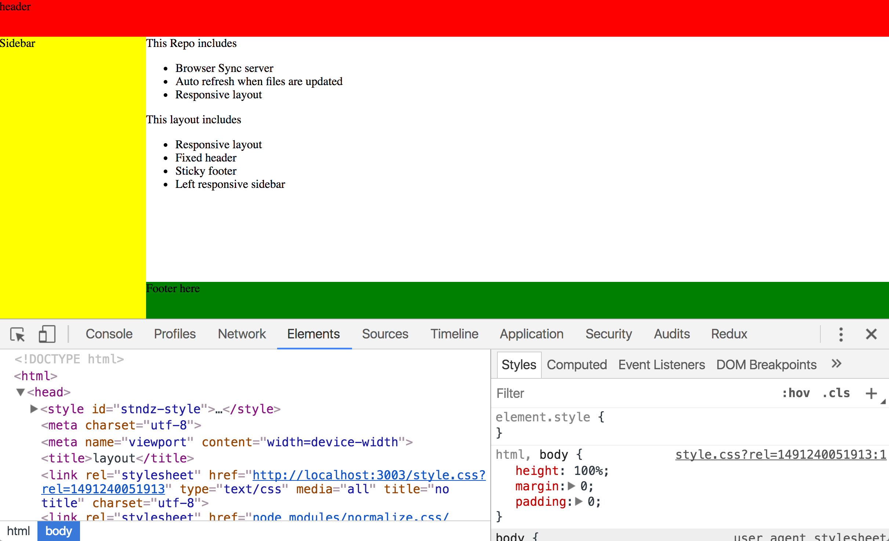

## Responsive layout with

 * browser-sync server
 * auth refresh when files are updated
 * fixed header
 * sticky footer
 * responsive left sidebar

#### Customize
 * Header height: 50px;
 * Footer height: 50px;
 * Sidebar width: 200px;
 * Responsive point at width 1200px;

 
